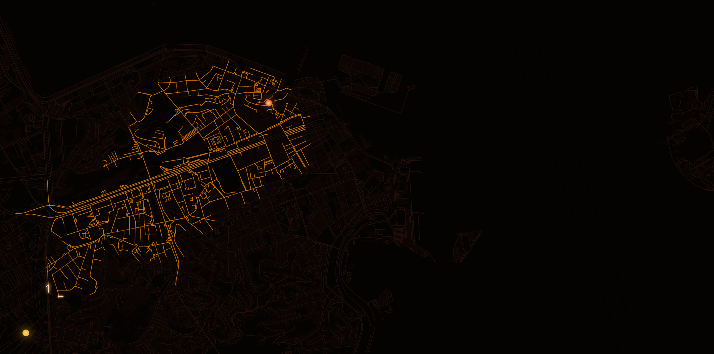

# Graph Algo Viz



Graph Algo Viz is an interactive Svelte app for watching classic graph algorithms move through real street networks from OpenStreetMap. It started as a study tool for graph algorithms and has grown into a visual playground for seeing how traversal, shortest-path, and spanning-tree strategies behave on actual city geometry.

## Open The App

- **Screensaver mode:** [open `/screensaver`](https://shlok-bhakta.github.io/graph_algo_viz/screensaver)
- **Quick A\* demo:** [watch A\* run across a city playlist](http://localhost:5173/graph_algo_viz/screensaver?play=1&algos=astar&locations=tokyo%2Cparis%2Cmanhattan%2Clondon%2Camsterdam%2Cbarcelona%2Csan-francisco%2Cchicago%2Cberlin%2Cvienna%2Cprague%2Cmontreal%2Cbuenos-aires%2Cmelbourne%2Ckyoto%2Clisbon%2Ctoronto%2Csingapore-core%2Cseoul%2Cmexico-city%2Cmadrid%2Chelsinki%2Cwashington-dc%2Cboston%2Cnew-york%2Cbrooklyn%2Clos-angeles%2Cseattle%2Cportland%2Caustin%2Cdenver%2Cmiami%2Cnew-orleans%2Cphiladelphia%2Catlanta%2Cminneapolis%2Cvancouver%2Cquebec-city%2Crio-de-janeiro%2Csao-paulo%2Csantiago%2Clima%2Cbogota%2Ccopenhagen%2Cstockholm%2Coslo%2Cdublin%2Cedinburgh%2Cbrussels%2Czurich%2Cmilan%2Crome%2Cvenice%2Cflorence%2Cathens%2Cistanbul%2Cwarsaw%2Cbudapest%2Cdubrovnik%2Cmarrakesh%2Ccairo%2Ccape-town%2Cnairobi%2Clagos%2Cdubai%2Ctel-aviv%2Cmumbai%2Cdelhi%2Cbangkok%2Chanoi%2Chong-kong%2Ctaipei%2Cshanghai%2Cbeijing%2Cosaka%2Ckuala-lumpur%2Cjakarta%2Csydney%2Cauckland&themes=ember&audio=0)

The local demo link assumes the Vite dev server is running on `http://localhost:5173`.

## What It Shows

- Real road graphs fetched from OpenStreetMap via Overpass.
- Animated algorithm state: visited nodes, active edges, source and target pins, and completion flashes.
- Multiple graph algorithms, including A\*, BFS, DFS, Dijkstra, Bellman-Ford, Prim, Kruskal, and random edge walks.
- A full-screen screensaver mode with city playlists, algorithm filters, visual themes, and optional autoplay.

## Development

```bash
npm install
npm run dev
```

Then open:

- Main app: `http://localhost:5173/graph_algo_viz/`
- Screensaver: `http://localhost:5173/graph_algo_viz/screensaver`

## Scripts

```bash
npm run dev      # start the Vite dev server
npm run build    # build the GitHub Pages output into docs/
npm run check    # run Svelte and TypeScript checks
npm run test     # run Vitest tests
```

## Notes

The app depends on live OpenStreetMap data, so map loading can vary with network conditions and Overpass availability. If a city fails to load, try relaunching the screensaver or choosing a smaller location set.
